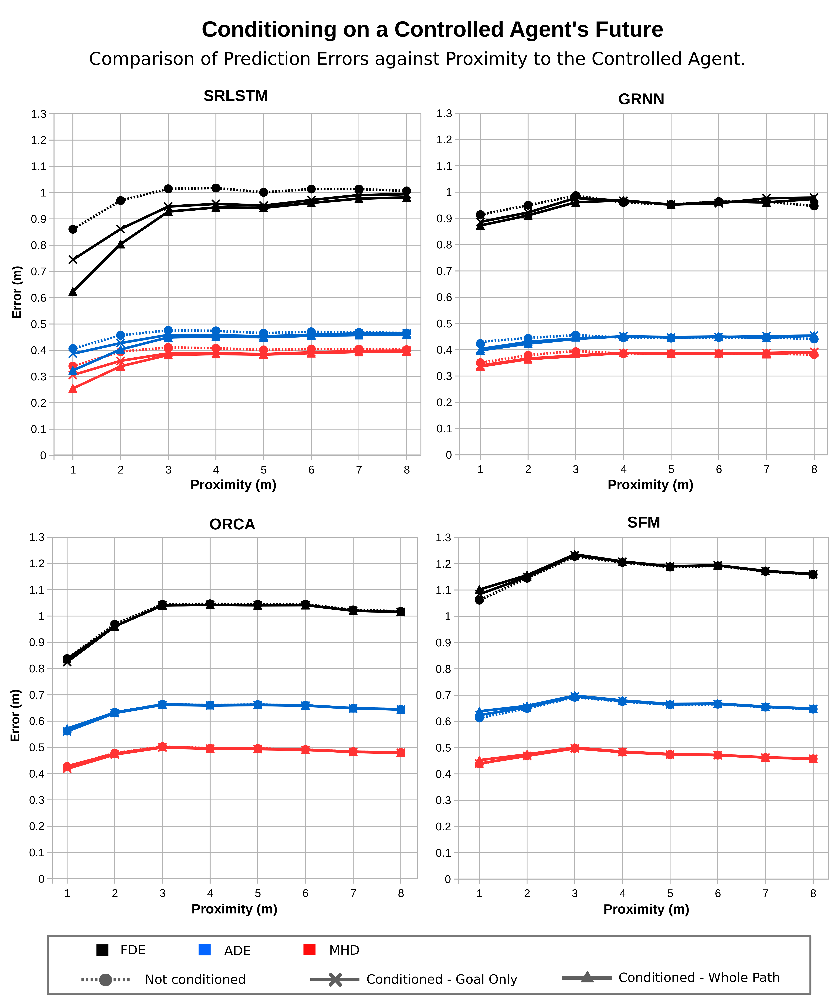
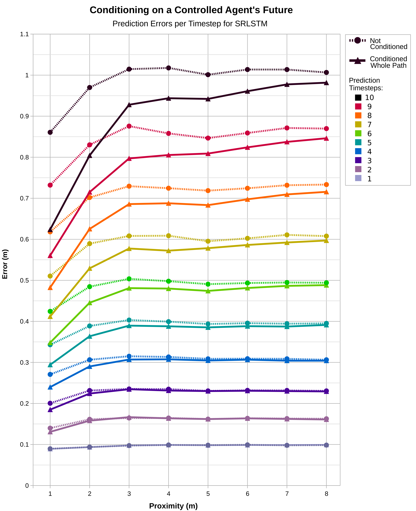

# Comparing Crowd Response Prediction
This repository contains a comparison of various crowd motion models in terms of their ability to predict the response of the crowd to the planned motion of a robot, or controlled agent.

## Description
Recent works have demonstrated how deep learning based approaches to trajectory prediction, specifically RNN based models, can be conditioned on the known or planned path of a controlled agent in order to improve the prediction accuracy of other nearby agents [[1]](https://arxiv.org/abs/2001.03093)[[2]](https://arxiv.org/abs/1911.00997)[[3]](https://arxiv.org/abs/1909.13486).

These works have claimed that this conditioning can allow the model to learn the likely response of an agent to a robot's planned action. By applying the model as a state transition function of form *S' = P(S,a)*, where the environment's next state *S'* is predicted from the current state *S* and next action *a*, this would allow simulation of 'hypothetical rollouts' to compare potential actions during path planning in a model-based predictive control approach. 

However, a comprehenisve analysis of the ability of these proposed predictive models to accurately learn the response of an agent to a robot's planned action, and so for use as state transition functions, has not yet been undertaken. Similarly, whilst many deep RL based approaches to crowd navigation make use of traditional pedestrian motion models such as ORCA [[4]](https://arxiv.org/abs/1609.07845)[[5]](https://arxiv.org/abs/1703.08862)[[6]](https://arxiv.org/abs/1809.08835)[[7]](https://arxiv.org/abs/1805.01956), these motion models are also yet to be evaluated in terms of their ability to be used as state transition functions.

This work compares two traditional and two deep learning based approaches on their ability to effectively predict the response of nearby agents to the future motion of a controlled agent.
 
This section compares the use of both the ground truth future of the controlled agent, as well as a planned future. This planned future is based only on the intended goal of the agent and aims to remove any possible dependency that the robot's future might have on the non-controlled agent's future, and so possible information leakage.
By comparing the accuracy of predictions when conditioned on the known future or intended goal of a controlled agent against the same models when no future is known, it is possible to determine to what degree the models are effectively learning the response and so validate their use as state transition models during path planning. 

****
## Comparisons

### Compared Methods
- SRLSTM [[8]](https://arxiv.org/abs/1903.02793)
- GRNN [[9]](https://arxiv.org/abs/2001.11597)
- ORCA [[10]](https://gamma.cs.unc.edu/ORCA/publications/ORCA.pdf)
- Social Force Model (SFM) [[11]](https://arxiv.org/abs/cond-mat/9805244)

### Methodology

Each compared model has been tested in terms of the predictive error in three different ways:
1. Not conditioned: No future information is known of the controlled agent.
2. Conditioned - Whole path: The ground truth future position of the controlled
agent is known for the entire predictive period.
3. Conditioned - Goal only: The ground truth future position of the controlled
agent is known only for final predictive timestep.

## Results

The results illustrated below demonstrate that only the RNN based approaches are able to learn any response of a crowd to a controlled agent's planned path, with the traditional ORCA and SFM based approaches showing no significant improvement in prediction accuracy when supplied even with the ground truth future motion of the controlled agent. 

Both SRLSTM and GRNN show improved performance in method 2 (Conditioned - Whole Path) compared to method 3 (Conditioned - Goal Only) as expected, however still exhibit significantly improved accuracies when compared to method 1 (Non-conditioned).
Additionally, it is clear that even without any knowledge of the controlled agent's goal, the learnt RNN models outperform both traditional models in all metrics, except for the final error of ORCA at very close proximity of just 1 m from the controlled agent.

The below figure illustrates how improved accuracy resulting from conditioning on a known future path increases at more disdtant timesteps for SRLSTM.
A comparison of the results from methods 1 and 2 on SRLSTM shows that when conditioned on a known path, the prediction at timestep 10 (4.0 s) can achieve a similar accuracy as a non-conditioned prediction two timesteps previsou at 3.2 s at the closest proximity of 1 m to the controlled agent. 
The accuracy improvement as a percentage of the total non-conditioned error at proximity of 1 m increases approximately linearly each timestep, from negligible improvement at the first timestep (0.32 \%) to 27.5\% error improvement at the final timestep.

## References

[[1] T. Salzmann, B. Ivanovic, P. Chakravarty, and M. Pavone, “Trajectron++: Multi-agent Generative Trajectory Forecasting with Heterogeneous Data for Control,” arXiv:2001.03093, 2020](https://arxiv.org/abs/2001.03093)

[[2] Y. C. Tang and R. Salakhutdinov, “Multiple Futures Prediction,” 2019.](https://arxiv.org/abs/1911.00997)

[[3] S. Eiffert and S. Sukkarieh, “Predicting Responses to a Robot’s Future Motion using Generative Recurrent Neural Networks,” Proceedings - ARAA Australasian Conference on Robotics and Automation (ACRA), 2019.](https://arxiv.org/abs/1909.13486)

[[4] Y. F. Chen, M. Liu, M. Everett, and J. P. How, “Decentralized Non-communicating Multiagent Collision Avoidance with Deep Reinforcement Learning,” IEEE International Conference on Robotics and Automation (ICRA), pp. 285–292, 2017.](https://arxiv.org/abs/1609.07845)

[[5] Y. F. Chen, M. Everett, M. Liu, J. P. How, and R. O. May, “Socially Aware Motion Planning with Deep Reinforcement Learning,” in IEEE International Conference on Intelligent Robots and Systems (IROS), 2017.](https://arxiv.org/abs/1703.08862)

[[6] C. Chen, Y. Liu, S. Kreiss, and A. Alahi, “Crowd-Robot Interaction: Crowd-aware Robot Navigation with Attention-based Deep Reinforcement Learning,” IEEE International Conference on Robotics and Automation (ICRA), pp. 6015 – 6022, 2019.](https://arxiv.org/abs/1809.08835)

[[7] M. Everett, Y. F. Chen, and J. P. How, “Motion Planning among Dynamic, Decision-Making Agents with Deep Reinforcement Learning,” IEEE International Conference on Intelligent Robots and Systems (IROS), pp. 3052–3059, 2018.](https://arxiv.org/abs/1805.01956)

[[8] P. Zhang, W. Ouyang, P. Zhang, J. Xue, and N. Zheng, “SR-LSTM: State Refinement for LSTM towards Pedestrian Trajectory Prediction,” in CVPR, 2019.](https://arxiv.org/abs/1903.02793)

[[9] S. Eiffert, H. Kong, N. Pirmarzdashti, and S. Sukkarieh, “Path Planning in Dynamic Environments using Generative RNNs and Monte Carlo Tree Search,” in 2020 IEEE International Conference on Robotics and Automation (ICRA), 2020a, pp. 10 263–10 269.](https://arxiv.org/abs/2001.11597)

[[10] J. Van Den Berg, S. J. Guy, M. Lin, and D. Manocha, “Reciprocal n-body Collision Avoidance,” Springer Tracts in Advanced Robotics, vol. 70, no. STAR, pp. 3–19, 2011.](https://gamma.cs.unc.edu/ORCA/publications/ORCA.pdf)

[[11] D. Helbing and P. Molnár, “Social Force Model for Pedestrian Dynamics,” Physical Review E: Statistical, Nonlinear, and Soft Matter Physics, vol. 51, no. 5, pp. 4282–4286, 1995.](https://arxiv.org/abs/cond-mat/9805244)

